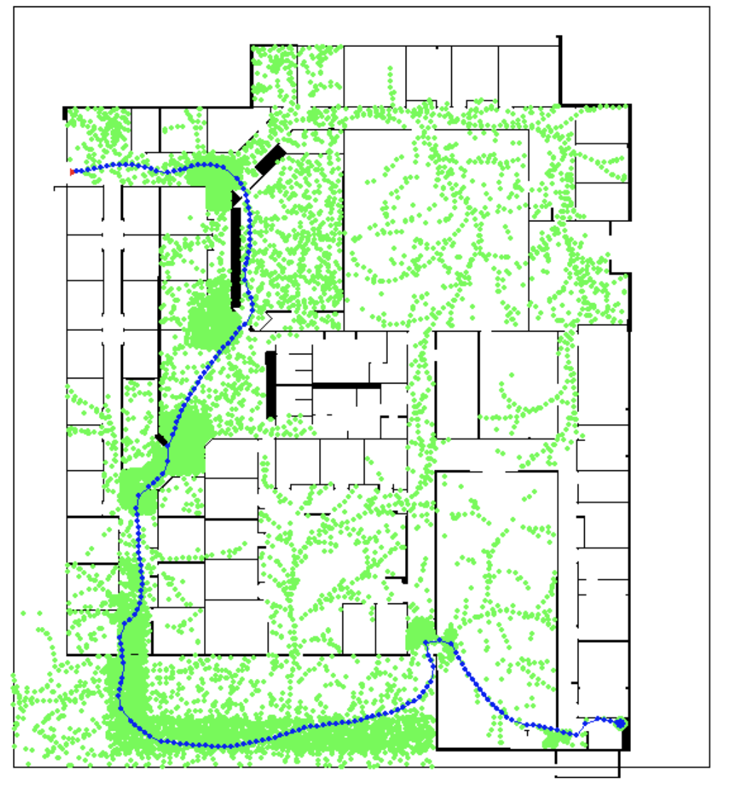
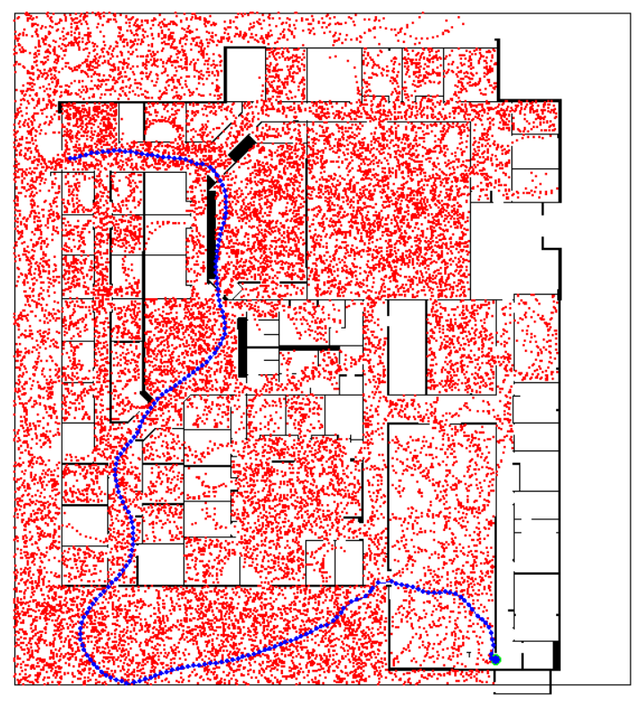

# Lab 2 Report

## Part A: Simulation

### 1. See the following figure demonstrating successful output from RRT

| |
| :--: |
| A rrt planning output figure
the triangle on top-left spot is the starting node and the blue cicle on the bottom-right spot is the our goal point. All green circles are the nodes that are collision-free and the blue circles connected by blue lines consists of the final trajectory of the robot. |

### 2. See the following figure illustrating successful output from RRT*
||
| :--: |
| A rrt* planning output figure
Red dots on the figure represent valid points without collision and blue dots conntected by blue lines represent a final trajectory from the start point (top-left) to the end point (bottom-right) |

### 3. See `trajectory-rollout-sim.mp4` for footage demonstrating a successful run of the trajectory rollout using RRT. (David)

- Please refer to the attached video `trajectory-rollout-sim.mp4`.
### 4. Algorithm descriptions
#### RRT Planning Algorithm

1. Sample a Random Point
   - Adjusted sampling strategy tailored to the 'Willow Garage Map':
     - Split the map into 10x10 small boxes and iterate over them from left to right and top to bottom.
     - Due to bottleneck regions with low visibility in the "Willow" map:
       - Implement extra small bottleneck regions.
       - Sample points 10 times in those bottleneck regions.

2. Find the Closest Point to the Sampled Point in the Node List:
   - Using Euclidean distance.

3. Find Trajectory to the Closest Point with Collision Check:
   - Controller:
     - Determine the overall platform's velocity.
     - For the number of self.timestep, compute configuration in the inertial frame (`trajectory_rollout` function).
     - Collision checking:
       - If the path to the new state is collision-free:
         - Add endpoint.
         - Add path from the nearest node to the endpoint.

4. Sampling and connecting nodes will repeat until the end point has been reached and successfully connected to. 
   
5. Return Success/Failure and the current tree.

#### RRT* Planning Algorithm

1. Sample a random point from any valid point within the map.

2. Find the node in the list of existing nodes that is "closest" to this new point (euclidean distance).

3. Connect the new point to the closest node in the list of existing nodes if the simulated trajectory between them is collision-free, compute and update this new point's cost-to-come acccordingly.

4. Check if there are any nodes present within a "ball" around the new point
  - If there are close nodes, perform rewiring if connecting the point to any of these close nodes will reduce its cost-to-come, and then proceed to step 5.
  - If there are no close nodes, proceed with sampling a new point.

5. Check for near nodes for the newly rewired point, and see if any improvements can be made with rewiring.
  - In the standard RRT* planning algorithm, this process will propagate until no improvements can be made.
  - However, to improve the runtime of our program, we limit the maximum number of rewires per instance to 5 at the cost the final solution not being perfectly optimized. 

6. Sampling and rewiring will repeat until the end point has been reached and successfully connected to.

7. Return the tree of nodes at the end of the planning algorithm.

## Part B: Real Environment Deployment (Incomplete)

1. ~~See `trajectory-rollout.mp4` for footage of the robot conducting trajectory rollout using RRT in the new Myhal map.~~
2. ~~Open-loop demonstration conducted during lab session~~

Code is attached
