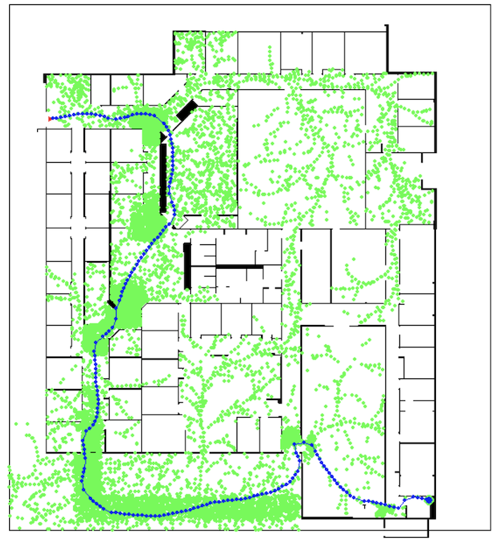

# Lab 2 Report

## Part A: Simulation

### 1. See the following figure demonstrating successful output from RRT

| |
| :--: |
| A rrt planning output figure
the triangle on top-left spot is the starting node and the blue cicle on the bottom-right spot is the our goal point. All green circles are the nodes that are collision-free and the blue circles connected by blue lines consists of the final trajectory of the robot. |

### 2. See the following figure illustrating successful output from RRT*
||
| :--: |
The start point is the first blue point in the top-left of the map and the goal is the large blue circle in the bottom-right of the map. Valid nodes that are part of the tree are displayed as red points. The final solution found to the goal is displayed as the path made up by all the blue points.

### 3. See `trajectory-rollout-sim.mp4` for footage demonstrating a successful run of the trajectory rollout using RRT. 

- Please refer to the attached video `trajectory-rollout-sim.mp4`.
### 4. Algorithm descriptions
#### 4-1. RRT Planning Algorithm

1. Sample a Random Point
   - Adjusted sampling strategy tailored to the 'Willow Garage Map':
     - Split the map into 10x10 small boxes and iterate over them from left to right and top to bottom.
     - Due to bottleneck regions with low visibility in the "Willow" map:
       - Implement extra small bottleneck regions.
       - Sample points 10 times in those bottleneck regions.

2. Find the Closest Point to the Sampled Point in the Node List:
   - Using Euclidean distance.

3. Find Trajectory to the Closest Point with Collision Check:
   - Controller:
     - Determine the overall platform's velocity.
     - For the number of self.timestep, compute configuration in the inertial frame (`trajectory_rollout` function).
     - Collision checking:
       - If the path to the new state is collision-free:
         - Add endpoint.
         - Add path from the nearest node to the endpoint.

4. Sampling and connecting nodes will repeat until the end point has been reached and successfully connected to. 
   
5. Return Success/Failure and the current tree.

#### 4-2. RRT* Planning Algorithm

1. Sample a random point from any valid point within the map.

2. Find the node in the list of existing nodes that is "closest" to this new point (euclidean distance).

3. Connect the new point to the closest node in the list of existing nodes if the simulated trajectory between them is collision-free, compute and update this new point's cost-to-come acccordingly.

4. Check if there are any nodes present within a "ball" around the new point
  - If there are close nodes, perform rewiring if connecting the point to any of these close nodes will reduce its cost-to-come, and then proceed to step 5.
  - If there are no close nodes, proceed with sampling a new point.

5. Check for near nodes for the newly rewired point, and see if any improvements can be made with rewiring.
  - In the standard RRT* planning algorithm, this process will propagate until no improvements can be made.
  - However, to improve the runtime of our program, we limit the maximum number of rewires per instance to 5 at the cost the final solution not being perfectly optimized. 

6. Sampling and rewiring will repeat until the end point has been reached and successfully connected to.

7. Return the tree of nodes at the end of the planning algorithm.


## Part B: Real Environment Deployment (Incomplete)

1. ~~See `trajectory-rollout.mp4` for footage of the robot conducting trajectory rollout using RRT in the new Myhal map.~~
2. ~~Open-loop demonstration conducted during lab session~~

We were not able to complete the Part B because we couldn't finish our `l2_follow_path.py` during the lab session. 

## Code 

Please refer to the following github repository for the entire code 
- https://github.com/DM1122/rob521-labs/tree/main/lab2 

### `l2_planning.py`

```python
#!/usr/bin/env python3
# Standard Libraries
import numpy as np
from pydantic import BaseModel, PositiveFloat
import yaml
import matplotlib.image as mpimg
from skimage.draw import disk
from pathlib import Path
from scipy.integrate import odeint
from jaxtyping import Float, Int
from beartype import beartype
from typing import Optional, Tuple, List, Union
from pydantic import Field
import random

on_remote = False  # set this to true if running on the remote machine

if not on_remote:
    from nodes import pygame_utils_custom
else:
    import pygame_utils_custom


def load_map(file_path: Path):
    im = mpimg.imread(str(file_path))
    if len(im.shape) > 2:
        im = im[:, :, 0]
    im_np = np.array(im)  # Whitespace is true, black is false
    # im_np = np.logical_not(im_np)
    return im_np


def load_map_yaml(file_path: Path):
    with open(file_path, "r") as stream:
        map_settings_dict = yaml.safe_load(stream)
    return map_settings_dict


class RectBounds(BaseModel):
    x: float = Field(
        description="The x-coordinate of the bottom left corner of the rectangle."
    )
    y: float = Field(
        description="The y-coordinate of the bottom left corner of the rectangle."
    )
    width: PositiveFloat = Field(
        description="The length of the rectangle in the x direction."
    )
    height: PositiveFloat = Field(
        description="The length of the rectangle in the y direction."
    )

    @property
    @beartype
    def bottom_left(self) -> Float[np.ndarray, "2"]:
        return np.array([self.x, self.y])

    @property
    @beartype
    def bottom_right(self) -> Float[np.ndarray, "2"]:
        return np.array([self.x + self.width, self.y])

    @property
    @beartype
    def top_right(self) -> Float[np.ndarray, "2"]:
        return np.array([self.x + self.width, self.y + self.height])

    @property
    @beartype
    def top_left(self) -> Float[np.ndarray, "2"]:
        return np.array([self.x, self.y + self.height])


# Node for building a graph
class Node:
    @beartype
    def __init__(
        self,
        point: Float[np.ndarray, "3"],
        parent_id: int,
        cost: float,
        children_ids: list = [],
    ):
        self.point = point  # A 3 by 1 vector [x, y, theta]
        self.parent_id = parent_id  # The parent node id that leads to this node (There should only every be one parent in RRT)
        self.cost = cost  # The cost to come to this node
        self.children_ids = children_ids  # The children node ids of this node


# Path Planner
class PathPlanner:
    # A path planner capable of perfomring RRT and RRT*
    @beartype
    def __init__(
        self,
        map_file_path: Path,
        map_settings_path: Path,
        goal_point: Union[Int[np.ndarray, "2"], Float[np.ndarray, "2"]],
        stopping_dist: float,
    ):
        # Get map information
        self.occupancy_map = load_map(map_file_path)
        self.map_shape = self.occupancy_map.shape
        self.map_settings_dict = load_map_yaml(map_settings_path)

        # map name 
        self.map_name = str(map_file_path)

        # Get the metric bounds of the map
        # origin, the upper right point (real world) because it is multiplied by the resolution
        # self.bounds = np.zeros([2, 2])  # m
        # self.bounds[0, 0] = self.map_settings_dict["origin"][0]
        # self.bounds[1, 0] = self.map_settings_dict["origin"][1]
        # self.bounds[0, 1] = (
        #     self.map_settings_dict["origin"][0]
        #     + self.map_shape[1] * self.map_settings_dict["resolution"]
        # )
        # self.bounds[1, 1] = (
        #     self.map_settings_dict["origin"][1]
        #     + self.map_shape[0] * self.map_settings_dict["resolution"]
        # )
        if "willow" in str(map_file_path):
            self.plan_bounds: RectBounds = RectBounds(x=-5, y=-47, width=55, height=60)
        elif "myhal" in str(map_file_path):
            self.plan_bounds: RectBounds = RectBounds(x=0.0, y=5.4, width=2.2, height=2.3)

        # Robot information
        self.robot_radius = 0.1  # m
        self.vel_max = 0.5  # m/s (Feel free to change!)
        self.rot_vel_max = 0.2  # rad/s (Feel free to change!)

        # Goal Parameters
        self.goal_point = goal_point  # m
        self.stopping_dist = stopping_dist  # m # the minimum distance btw the goal point and the final position where the robot should come to stop

        # Trajectory Simulation Parameters
        self.timestep = 1.0  # s
        self.num_substeps = 10

        # Planning storage
        if "myhal" in self.map_name: # myhal map's start point is different from the other maps
            self.nodes: list[Node] = [
            Node(point=np.array([0.1, 5.5, -0.0]), parent_id=-1, cost=0.0)
        ]
        else:

            self.nodes: list[Node] = [
                Node(point=np.array([0.0, 0.0, 0.0]), parent_id=-1, cost=0.0)
            ]

        # RRT* Specific Parameters
        self.lebesgue_free = (
            np.sum(self.occupancy_map) * self.map_settings_dict["resolution"] ** 2
        )
        self.zeta_d = np.pi
        self.gamma_RRT_star = (
            2 * (1 + 1 / 2) ** (1 / 2) * (self.lebesgue_free / self.zeta_d) ** (1 / 2)
        )
        self.gamma_RRT = self.gamma_RRT_star + 0.1
        self.epsilon = 2.5

        # Pygame window for visualization
        self.window = pygame_utils_custom.PygameWindow(
            "Path Planner",
            (800, 800),
            self.occupancy_map.shape,
            map_file_path,
            self.map_settings_dict,
            self.goal_point,
            self.stopping_dist,
        )

        self.window.add_point(
            map_frame_point=self.goal_point,
            radius=4,
            color=(0, 0, 255),
        )


        # draw planning bounds
        self.window.add_line(
            self.plan_bounds.bottom_left, self.plan_bounds.bottom_right
        )
        self.window.add_line(self.plan_bounds.bottom_right, self.plan_bounds.top_right)
        self.window.add_line(self.plan_bounds.top_right, self.plan_bounds.top_left)
        self.window.add_line(self.plan_bounds.top_left, self.plan_bounds.bottom_left)

    # Functions required for RRT
    @beartype
    def sample_map_space(self, bounds: RectBounds) -> Float[np.ndarray, "2"]:
        """
        Returns a random point (expressed in meters wrt map origin) that lies within the provided bounds.
        """
        # Generate a random point within the bounds
        random_x = random.uniform(bounds.x, bounds.x + bounds.width)
        random_y = random.uniform(bounds.y, bounds.y + bounds.height)

        # Create a numpy array with the random point
        random_point = np.array([random_x, random_y])

        return random_point

    @beartype
    def check_if_duplicate(self, point: Float[np.ndarray, "2"]) -> bool:
        """
        Check if point is a duplicate of an already existing node's point in the list.
        """
        for node in self.nodes:
            if np.allclose(
                node.point[:2], point, atol=1e-5
            ):  # Compare x and y coordinates within a tolerance
                return True
        return False

    def closest_node(self, point: Float[np.ndarray, "2"]) -> int:
        """
        Finds the index of the node that is closest to the given point.

        This method calculates the Euclidean distance from the given point to the points of all nodes in the list `self.nodes`. It then returns the index of the node with the minimum distance.

        Args:
            point: A 2D NumPy array representing the point for which the closest node is to be found. The array should contain two elements representing the x and y coordinates.

        Returns:
            int: The index of the closest node in the `self.nodes` list.
        """
        # Extract points from nodes and form a 2D array
        node_points = np.array([node.point[:2] for node in self.nodes])

        distances = np.linalg.norm(node_points - point, axis=1)

        closest_node_index = np.argmin(distances)

        return int(closest_node_index)

    @beartype
    def simulate_trajectory(
        self, point_i: Float[np.ndarray, "3"], point_s: Float[np.ndarray, "2"]
    ) -> Optional[Float[np.ndarray, "N 3"]]:
        """Simulates the non-holonomic motion of a robot towards a target point.

        This function drives the robot from its current state (node_i) towards a
        specified target point (point_s). It uses a robot controller to calculate
        the necessary linear and angular velocities and then simulates the robot's
        trajectory using these velocities.

        Args:
            node_i: A 3x1 vector representing the current state of the
                                robot. It includes the robot's x and y
                                coordinates and its orientation theta, i.e., [x; y; theta].
            point_s: A 2x1 vector representing the target point in Cartesian
                                coordinates, i.e., [x; y].

        Returns:
            numpy.array | None: An array representing the simulated trajectory of the robot, or None if it collides
        """
        vel, rot_vel = self.robot_controller(point_i, point_s)
        
        robot_traj = self.trajectory_rollout(vel, rot_vel, point_i)
        robot_traj_global = robot_traj
        
        collision = self.check_collision(robot_traj_global[:, 0:2])
        if not collision:
            return robot_traj_global
        else:
            return None

    @beartype
    def robot_controller(
        self, point_i: Float[np.ndarray, "3"], point_s: Float[np.ndarray, "2"]
    ) -> Tuple[float, float]:
        """
        This controller determines the velocities that will nominally move the robot from node i to node s.
        Adjust the linear and rotational velocities based on the distance and the angular difference between
        the robot's current position (node_i) and the target point (point_s).
        Max velocities should be enforced.
        """

        x_i, y_i, theta_i = point_i  # robot current position
        x_s, y_s = point_s  # target point

        # Calculate the distance from the robot to the target point
        distance = np.sqrt((x_s - x_i) ** 2 + (y_s - y_i) ** 2)

        # Calculate the angle to the target point considering the robot's current orientation
        angle_to_target = np.arctan2(y_s - y_i, x_s - x_i) - theta_i

        # Normalize the angle_to_target to the range [-pi, pi]
        angle_to_target = (angle_to_target + np.pi) % (2 * np.pi) - np.pi

        # Scale the rotational velocity based on the angular difference
        # Apply maximum angular velocity at ±90 to ±180 degrees
        # Scale linearly to 0 as it approaches ±0 degrees
        if np.abs(angle_to_target) > np.pi / 2:
            rotational_vel = self.rot_vel_max
        else:
            rotational_vel = (2 * self.rot_vel_max / np.pi) * np.abs(angle_to_target)

        # Ensure rotational velocity is in the correct direction
        rotational_vel *= np.sign(angle_to_target)

        # Calculate proportional linear velocity
        linear_vel = 1 * distance

        # Enforce maximum velocity limits
        linear_vel = min(linear_vel, self.vel_max)
        rotational_vel = min(np.abs(rotational_vel), self.rot_vel_max) * np.sign(
            rotational_vel
        )

        return linear_vel, rotational_vel

    @beartype
    def trajectory_rollout(
        self, vel: float, rot_vel: float, init_point: Float[np.ndarray, "3"]
    ) -> Float[np.ndarray, "N 3"]:
        """
        Compute the trajectory of a robot given linear and angular velocities.

        This method calculates the future trajectory of the robot over a fixed time horizon based on the provided linear velocity `vel` and rotational velocity `rot_vel`. The trajectory is determined by solving a system of ordinary differential equations (ODEs) that describe the robot's motion. The initial position of the robot is assumed to be at the origin of its reference frame.
        Assumes the robot starts from the origin (x=0, y=0) with an initial angle of 0 radians.

        Args:
            vel (float): The linear velocity of the robot in meters per second.
            rot_vel (float): The rotational velocity of the robot in radians per second.

        Returns:
            np.ndarray: An N x 3 matrix representing the trajectory of the robot. Each row corresponds to a point in time, with the first column being the x-coordinate, the second column the y-coordinate, and the third column the angle of the robot with respect to the global frame.
        """

        def system_dynamics(state, t, v, omega):
            # Define the system of ODEs
            x, y, theta = state
            x_dot = v * np.cos(theta)
            y_dot = v * np.sin(theta)
            theta_dot = omega
            return [x_dot, y_dot, theta_dot]

        # Initial conditions
        x_0 = init_point[0]
        y_0 = init_point[1]
        theta_0 = init_point[2]

        t_proj = self.timestep  # number of seconds to project into the future
        t = np.linspace(0, t_proj, self.num_substeps)

        # Solve ODE
        solution = odeint(
            func=system_dynamics, y0=[x_0, y_0, theta_0], t=t, args=(vel, rot_vel)
        )

        return solution

    @beartype
    def point_to_cell(self, point: np.ndarray) -> np.ndarray:
        """Converts a series of [x,y] points in the map to occupancy map cell indices.

        This function computes the cell indices in the occupancy map for each provided [x, y] point.

        Args:
            point (np.ndarray): An N by 2 matrix of points of interest, where N is the number of points.

        Returns:
            np.ndarray: An array of cell indices [row,col] in the occupancy map corresponding to each input point.
        """
        if point.ndim != 2:
            raise ValueError(
                f"Input array must be 2-dimensional, received {point.ndim}"
            )

        if point.shape[1] != 2:
            raise ValueError(
                f"Input array must have a shape of Nx2, received: {point.shape}"
            )

        # Retrieve the origin from the map settings.
        origin = self.map_settings_dict["origin"]  # origin: [-21.0, -49.25, 0.000000]

        # Adjust the points by the origin offset
        adjusted_point = point - origin[:2]

        # Compute cell indices
        cell = adjusted_point * self.map_settings_dict["resolution"] ** -1
        cell = np.floor(cell)
        cell = cell.astype(int)

        cell[:, 1] = cell[:, 1] - self.map_shape[1]
        cell[:, 1] *= -1

        # flip x y for yx
        x = cell[:, 1]
        y = cell[:, 0]

        cell = np.column_stack((x, y))

        return cell

    @beartype
    def points_to_robot_circle(self, points: np.ndarray) -> List[np.ndarray]:
        """
        Converts a series of [x, y] coordinates to robot map footprints for collision detection.

        This function calculates the pixel locations of a robot's path and converts them into
        footprints based on the robot's radius. These footprints are used for collision detection.

        Args:
            points (np.ndarray): A 2-dimensional numpy array of shape Nx2, where each row
                represents an [x, y] coordinate.

        Returns:
            list[np.ndarray]: A list of numpy arrays. Each array in the list is an Nx2 array
                representing the coordinates of a circle footprint around each point.

        Note:
            The size of the circle footprint is determined by the robot's radius and the map settings.
        """

        if points.ndim != 2:
            raise ValueError(
                f"Input array must be 2-dimensional, received {points.ndim}"
            )

        if points.shape[1] != 2:
            raise ValueError(
                f"Input array must have a shape of Nx2, received: {points.shape}"
            )

        robot_radius_in_cells = (
            self.map_settings_dict["resolution"] ** -1 * self.robot_radius
        )

        circles = []
        for i in range(points.shape[0]):
            point = points[i : i + 1]
            cell_coords = self.point_to_cell(point)[0]
            x_coords, y_coords = disk(
                center=cell_coords,
                radius=robot_radius_in_cells,
                shape=self.map_shape,
            )
            circle_coords = np.vstack(
                (x_coords, y_coords)
            ).T  # Stacking and transposing
            circles.append(circle_coords)

        return circles

    # Note: If you have correctly completed all previous functions, then you should be able to create a working RRT function

    # RRT* specific functions
    @beartype
    def ball_radius(self) -> float:
        """
        Calculate the radius of the ball used for finding close neighbors in the RRT* algorithm.

        This method computes the radius based on the current number of nodes in the tree (`self.nodes`)
        and two parameters: `self.gamma_RRT` and `self.epsilon`. The radius is determined by the minimum
        of two values: one derived from `gamma_RRT` and the logarithm of the cardinality of the nodes,
        and the other being a fixed small value `epsilon`. It adjusts dynamically as the number of nodes in the tree changes.

        Returns:
            float: The calculated radius value for finding close neighbors.
        """
        card_V = len(self.nodes)
        return min(
            self.gamma_RRT * (np.log(card_V) / card_V) ** (1.0 / 2.0), self.epsilon
        )

    @beartype
    def connect_node_to_point(
        self, node_i: Node, point_f: Float[np.ndarray, "2"]
    ) -> Optional[Float[np.ndarray, "N 3"]]:
        """
        Generates a trajectory from the point in node_i to point_f in a Nx3 array.
        Args:
            node_i (node): Origin node
            point_f (point): Destination point

        Returns:
            np.array | None: A Nx3 array representing the path from node_i to point_f if valid
        """
        curr_point = node_i.point
        destination = point_f
        traj = curr_point
        # print(f"stuck in the connect_to_node_")
        while True:
           
            # Within the while loop, at random specific times, we couldn't find `simulate_trajectory` 
            # This could be because `simulate_trajectory` couldn't find a path and kept getting stuck vs. it found a path but there's no solution below so it kept searching.
            # In the latter case, it might be that the path always the same.
            # It turned out to be the latter, and it kept finding the same path, but it was trapped inside the while loop because the stopping distance was always larger.

            curr_traj = self.simulate_trajectory(curr_point, destination)
            
            if curr_traj is None:
                return None
            traj_end = curr_traj[-1]
            traj = np.vstack((traj, curr_traj))
            # if np.linalg.norm(traj_end[:2] - destination) < self.stopping_dist:
            if self.stopping_dist - np.linalg.norm(traj_end[:2] - destination) < 1e-6: # important to make the threshold not using inequality sign
                break
            # When it exceeds self.stopping_dist, there's no way out; 
            # the problem here is that the simulate_trajectory above is deterministic (calculating the path with the same equation between the same points), so there's no way to break out of this loop.
            else:
                if np.any(np.not_equal(curr_point,traj_end)): # python do not know how to deal with array of booleans 
                    curr_point = traj_end
                else:
                    return None
        return traj

    @beartype
    def cost_to_come(self, trajectory: Float[np.ndarray, "N 3"]) -> float:
        """
        Computes the total Euclidean distance travelled between all substeps in a given trajectory.

        Args:
            trajectory: Array of the path taken between two points.

        Returns:
            cost: Cost of traversing the given trajectory.
        """
        total_cost = 0.0

        # Iterate over the trajectory array
        for i in range(1, len(trajectory)):
            distance = float(np.linalg.norm(trajectory[i] - trajectory[i - 1]))
            total_cost += distance

        return total_cost

    @beartype
    def update_children(self, node_id: int, delta_cost: float):
        """
        Recursively updates the cost of child nodes based on the delta of the updated cost of their parent node.

        This method calculates the delta as the difference between the new cost and the current cost of the parent node.
        Upates the cost of the current node. It then iterates over all children of the specified node, recalculating their costs based on this delta.
        The updated costs are then assigned to each child node.

        Args:
            node_id (int): The identifier of the parent node whose children's costs are to be updated.
            new_cost (float): The new cost to be set for the parent node.
        """
        node = self.nodes[node_id]
        node.cost += delta_cost  # Update the cost of the current node

        for child_id in node.children_ids:
            # Recursively update the children of this child node
            self.update_children(child_id, delta_cost)

    @beartype
    def is_trajectory_out_of_bounds(self, trajectory: Float[np.ndarray, "N 2"]) -> bool:
        """
        Checks if the trajectory is out of the bounds of the map.

        Args:
            trajectory: Points in the trajectory

        Returns:
            bool: True if any point in the trajectory is out of bounds, False otherwise.
        """
        for point in trajectory:
            if not (
                self.plan_bounds.x
                <= point[0]
                <= self.plan_bounds.x + self.plan_bounds.width
                and self.plan_bounds.y
                <= point[1]
                <= self.plan_bounds.y + self.plan_bounds.height
            ):
                return True
        return False

    @beartype
    def check_collision(self, trajectory: Float[np.ndarray, "N 2"]) -> bool:
        """
        Determines if a given trajectory results in a collision based on the occupancy map and the robot's footprint.

        The method evaluates if any point along the trajectory or the robot's footprint at those points
        collides with an obstacle as defined in the occupancy map.

        Args:
            trajectory (np.ndarray): A 2-dimensional array representing the trajectory of
                                    the robot in metric coordinates wrt map frame.

        Returns:
            bool: True if a collision is detected within the robot's footprint at any
                point along the trajectory. False otherwise.
        """
        bounds_check = self.is_trajectory_out_of_bounds(trajectory)
        if bounds_check:
            return True  # out of bounds

        # Convert trajectory points to cell coordinates
        cells = self.point_to_cell(trajectory[:, 0:2])

        # Generate robot footprints for each trajectory point
        footprints = self.points_to_robot_circle(trajectory[:, 0:2])  # list[np.ndarray]

        # Check each cell in the footprint for collision
        for footprint in footprints:
            for point in footprint:
                x, y = point
                # Check if the point is within the map bounds
                
                if (
                    0 <= x < self.occupancy_map.shape[1]
                    and 0 <= y < self.occupancy_map.shape[0]
                ):
                    if self.occupancy_map[x, y] == 0:
                        return True  # Collision detected
        return False  # No collision detected

    @beartype
    def is_goal_reached(self, node_point: Float[np.ndarray, "3"]) -> bool:
        """
        Check if the goal has been reached within the stopping distance.

        Args:
        node_point (np.ndarray): The current node point as a numpy array [x, y, theta].

        Returns:
            bool: True if the goal is reached, False otherwise.
        """
        # Extract the x, y coordinates of the node point and the goal point
        node_x, node_y = node_point[0], node_point[1]
        goal_x, goal_y = self.goal_point[0], self.goal_point[1]

        # Compute the Euclidean distance between the current node and the goal point
        distance_to_goal = np.sqrt((goal_x - node_x) ** 2 + (goal_y - node_y) ** 2)

        # Check if the distance is within the specified stopping distance
        if distance_to_goal <= self.stopping_dist:
            return True
        return False

    # Planner Functions
    def rrt_planning(self):
        """
        RRT alogrithm on the given map and robot
        1) sample one random point
        2) find the closest point in the node list
        3) find trajectory to the closest point
        4) check for the collision (if the trajectory collides with an obstacle)
            - if path to NEW_STATE is collision free
                - Add end point
                - Add path from nearest node to end point
        5) retrun success/failure and current tree
        """

        def rrt_cost_come(trajectory_o):
            cost = 0.0
            for i in range(1, len(trajectory_o)):
                # Calculate the distance between consecutive points
                dist = np.linalg.norm(trajectory_o[i] - trajectory_o[i - 1])

                # Accumulate the cost
                cost += dist

            return cost           


        # new strategy for sampling 
        # split the map into 10 * 10 small boxes, 
        # iterate over the small boxes from left to right and top to bottom 
        # for the long planning, 
        # for the deliverable, our goal has to set to (43, -43.6)
        i = 0 
        k = 0
        # special background knowledge on the map 
        # since there is an bottle neck in the "willow" map, sampling 10 times more in that bottle neck region 
        n_times_bottle_neck = 0
        n_bottle_neck = 0
        if "willow" in self.map_name:
            ############ willow map setting, hyperparameter 
            n_split = 5
            n_times_bottle_neck = 5
            n_bottle_neck = 9
            ##########################

            split_width = self.plan_bounds.width // n_split 
            split_height = self.plan_bounds.height // n_split
            
            reset_timing = n_split * n_split 

            cur_y = self.plan_bounds.top_left[1] - split_height
            cur_x = self.plan_bounds.top_left[0] 
        elif "myhal" in self.map_name:
            # myhal from left-bottom to right-top 
            ############ myhal map setting, hyperparameter 
            n_split = 2
            ##########################
            split_width = self.plan_bounds.width / n_split 
            split_height = self.plan_bounds.height / n_split
            reset_timing = n_split * n_split 

            cur_y = self.plan_bounds.bottom_left[1]
            cur_x = self.plan_bounds.bottom_left[0] 
            
        else:
            ############ normal map setting 
            n_split = 5
            ##########################
            split_width = self.plan_bounds.width / n_split 
            split_height = self.plan_bounds.height / n_split
            cur_y = self.plan_bounds.top_left[1] - split_height
            cur_x = self.plan_bounds.top_left[0] 
            reset_timing = n_split * n_split 

            cur_y = self.plan_bounds.top_left[1] - split_height
            cur_x = self.plan_bounds.top_left[0] 
       

        while True:

            if "willow" in self.map_name:
                # adjust the sampling bounding boxes 
                # RectBounds(x=-5, y=-47, width=55, height=60)
                if (i % n_split != 0 and i < reset_timing) or i ==0: # move along the x-axis
                    cur_bounds = RectBounds(x=cur_x + split_width*(i%n_split),\
                                            y=cur_y,\
                                            width=split_width, height=split_height)
                elif i % n_split == 0 and i <reset_timing: # move along the y-axis by "one" unit box 
                    cur_y = cur_y - split_height
                    cur_bounds = RectBounds(x=self.plan_bounds.top_left[0] + split_width*(i%n_split),\
                            y= cur_y,\
                            width=split_width, height=split_height)
            
                elif i < reset_timing + n_times_bottle_neck: # number 1 bottleneck 
                    cur_bounds = RectBounds(x= 10.0,\
                            y=  -2.0,\
                            width= 2, height=2)
                elif i < reset_timing + n_times_bottle_neck*2: # number 2 bottleneck
                    cur_bounds = RectBounds(x= 10.0,\
                            y=  -13.0,\
                            width= 2, height=3.5)
                elif i < reset_timing + n_times_bottle_neck*3: # number 3 bottleneck
                    cur_bounds = RectBounds(x= 7,\
                            y=  -23.0,\
                            width= 3, height=3)
                    
                elif i < reset_timing + n_times_bottle_neck*4: # number 4 bottleneck
                    cur_bounds = RectBounds(x= 4.5,\
                            y=  -26.0,\
                            width= 1.5, height=2)
                    
                elif i < reset_timing + n_times_bottle_neck*5: # number 5 bottleneck
                    cur_bounds = RectBounds(x= 3.5,\
                            y=  -43.6,\
                            width= 1, height=12)
                    
                elif i < reset_timing + n_times_bottle_neck*6: # number 6 bottleneck
                    cur_bounds = RectBounds(x= 3.5,\
                            y=  -45.0,\
                            width= 24, height=1)
                    
                elif i < reset_timing + n_times_bottle_neck*7: # number 7 bottleneck
                    cur_bounds = RectBounds(x= 27,\
                            y=  -38.0,\
                            width= 2, height=1.5)
                elif i < reset_timing + n_times_bottle_neck*8: # number 8 bottleneck
                    cur_bounds = RectBounds(x= 35,\
                            y=  -45.5,\
                            width= 3, height=1.5)
                
                else: # number 9 bottelneck 
                    cur_bounds = RectBounds(x= 39.5,\
                            y=  -45,\
                            width= 1.5, height=1.5)
            elif "myhal" in self.map_name:
                # adjust the sampling bounding boxes 
                if i == 0 or (i % n_split != 0 and i < reset_timing): # move along the x-axis
                 
                    cur_bounds = RectBounds(x=cur_x + split_width*(i%n_split),\
                                            y=cur_y,\
                                            width=split_width, height=split_height)
                elif i % n_split == 0 and i <reset_timing: # move along the y-axis by "one" unit box 
                    cur_y = cur_y + split_height
                    cur_bounds = RectBounds(x=self.plan_bounds.bottom_left[0],\
                            y= cur_y,\
                            width=split_width, height=split_height)
            
            else:
                # adjust the sampling bounding boxes 
                if (i % n_split != 0 and i < reset_timing) or i ==0: # move along the x-axis
                 
                    cur_bounds = RectBounds(x=cur_x + split_width*(i%n_split),\
                                            y=cur_y,\
                                            width=split_width, height=split_height)
                elif i % n_split == 0 and i <reset_timing: # move along the y-axis by "one" unit box 
                    cur_y = cur_y - split_height
                    cur_bounds = RectBounds(x=self.plan_bounds.top_left[0] + split_width*(i%n_split),\
                            y= cur_y,\
                            width=split_width, height=split_height)
            
            
            point = self.sample_map_space(cur_bounds)
            i += 1 
            k +=1 
            
            if i % (reset_timing + n_times_bottle_neck*n_bottle_neck) == 0: # go back to the top-left box again
                i = 0
                if "myhal" in self.map_name:             
                    cur_x = self.plan_bounds.bottom_left[0] 
                    cur_y = self.plan_bounds.bottom_left[1] 

                else:
                
                    cur_x = self.plan_bounds.top_left[0] 
                    cur_y = self.plan_bounds.top_left[1] - split_height
            
            
            # ############ if you want to see sampling points 
            self.window.add_point(
                map_frame_point=point,
                radius=2,
                color=(255, 0, 0),
            )

            closest_node_id = self.closest_node(point)
            closest_node = self.nodes[closest_node_id]  # (3, 1)

            # Simulate driving the robot towards the closest point
            # connect_node_to_point include collision check 
            trajectory_o = self.connect_node_to_point(
                closest_node, point.reshape(2)
            )  # (100,3)
            if trajectory_o is None: 
                continue

            # If no collision, Add the new node
            new_node_point = trajectory_o[-1]  # The last point of the trajectory
            new_node_cost = (
                closest_node.cost + rrt_cost_come(trajectory_o)
            )  # update cost-to-come in rrt planning but does not use it to rewire the edge
            new_node = Node(new_node_point, closest_node_id, new_node_cost)
            self.nodes.append(new_node)

            ############# """ If you want to see the added new node "
            self.window.add_point(
                map_frame_point=new_node_point[:2],
                radius=2,
                color=(0, 255, 0),
            )

            ####### searching for a specific point location 
            if "myhal" in self.map_name: # start point 
                self.window.add_point(
                    map_frame_point=np.array([0.2,5.7]),
                    radius=10,
                    color=(0, 0, 255),
                )
            # else:
            #     self.window.add_point(
            #         map_frame_point=np.array([0.2,5.7]),
            #         radius=10,
            #         color=(0, 0, 255),
            #     )
            
            new_node_id = len(self.nodes) - 1
            closest_node.children_ids.append(new_node_id)

            # Step 6: Check if goal is reached
            if self.is_goal_reached(new_node_point):
                final_node = self.nodes[-1]
                final_trajectory = [final_node.point]

                # drawing graph for the delivaraible
                while final_node.parent_id != -1:
                    final_trajectory = [
                        self.nodes[final_node.parent_id].point
                    ] + final_trajectory
                    final_node = self.nodes[final_node.parent_id]
            
                for index, point in enumerate(final_trajectory):
                    self.window.add_point(
                        map_frame_point=point[:2],
                        radius=2,
                        color=(0, 0, 255),
                    )
                    if index < len(final_trajectory) - 1:
                        self.window.add_line(
                            point[:2],
                            final_trajectory[index + 1][:2],
                            width=1,
                            color=(0, 0, 255),
                        )
                return self.nodes

            # Helper function to find nodes that are within a certain radius to a given point

    def find_near_nodes(self, point):
        near_nodes = []
        radius = self.ball_radius()

        for node_id, node in enumerate(self.nodes):
            node = self.nodes[node_id]
            dist = float(np.linalg.norm(node.point - point))
            if dist <= radius:
                near_nodes.append(node_id)

        return near_nodes

    def is_ancestor(self, node, potential_ancestor_id):
        current_node = node
        while current_node.parent_id != -1:
            if current_node.parent_id == potential_ancestor_id:
                return True
            current_node = self.nodes[current_node.parent_id]
        return False

    def rrt_star_planning(self):
        """
        Performs RRT* for the given map and robot. Currently performing a while loop, 
        can be replaced with an iterative process to make use of RRT*'s "anytime" capability.
        """
        goal = self.goal_point
        
        while True:
            # Sample
            new_point = self.sample_map_space(self.plan_bounds)
            
            # ############ if you want to see sampling points 
            # self.window.add_point(
            #     map_frame_point=new_point,
            #     radius=2,
            #     color=(255, 0, 0),
            # )

            # # Find closest node
            closest_node_id = self.closest_node(new_point)
            closest_node = self.nodes[closest_node_id]

            # # Simulate trajectory and check for collision
            trajectory_o = self.connect_node_to_point(closest_node, new_point)
            if trajectory_o is None:
                continue
            trajectory_cost = self.cost_to_come(trajectory_o)

            # # Add new node with associated costs
            new_node = Node(
                trajectory_o[-1],
                closest_node_id,
                closest_node.cost + trajectory_cost,
                [],
            )
            self.nodes.append(new_node)
            
            self.window.add_point(
                map_frame_point=np.array(new_node.point[:2]),
                radius=1,
                color=(0, 255, 0),
            )

            closest_node.children_ids.append(len(self.nodes) - 1)

            curr_node_id = len(self.nodes) - 1
            curr_node = self.nodes[curr_node_id]

            """Last node rewiring, treats the new node as a child and finds the best parent"""

            # Find list of near node IDs within the ball radius
            near_nodes = self.find_near_nodes(curr_node.point)
            for near_node_id in near_nodes:
                if curr_node.parent_id == near_node_id:
                    continue  # Skip if we are checking for existing connection
                near_node = self.nodes[near_node_id]
                new_trajectory = self.connect_node_to_point(
                    near_node, curr_node.point[:-1]
                )  # near_node ---> curr_node
                if new_trajectory is None:
                    continue  # Skip if collision is detected for this node

                new_trajectory_cost = self.cost_to_come(new_trajectory) + near_node.cost
                if new_trajectory_cost < curr_node.cost:
                    curr_node.cost = new_trajectory_cost  # update cost of current node
                    self.nodes[curr_node.parent_id].children_ids.remove(
                        curr_node_id
                    )  # remove current node as a child of its current parent
                    curr_node.parent_id = (
                        near_node_id  # update new parent of current node
                    )
                    near_node.children_ids.append(
                        curr_node_id
                    )  # add current node as a child of the new parent

            """Near edge rewiring, treats the new node as a parent and checks for potential children"""
            for _ in range(5):
                near_nodes = self.find_near_nodes(curr_node.point)
                for near_node_id in near_nodes:
                    if self.is_ancestor(curr_node, near_node_id) or near_node_id == -1:
                        continue  # Skip if near node is an ancestor of current node
                    near_node = self.nodes[near_node_id]
                    new_trajectory = self.connect_node_to_point(
                        curr_node, near_node.point[:-1]
                    )  # curr_node ---> near_node
                    if new_trajectory is None:
                        continue  # Skip if collision is detected for this node

                    new_trajectory_cost = (
                        self.cost_to_come(new_trajectory) + curr_node.cost
                    )

                    if new_trajectory_cost < near_node.cost:
                        delta = near_node.cost - new_trajectory_cost
                        near_node.cost = new_trajectory_cost  # update cost of near node
                        self.nodes[near_node.parent_id].children_ids.remove(
                            near_node_id
                        )  # remove near node as a child of its parent
                        near_node.parent_id = (
                            curr_node_id  # update new parent of near node
                        )
                        curr_node.children_ids.append(
                            near_node_id
                        )  # add near node as a child of the current node
                        self.update_children(
                            near_node_id, delta
                        )  # update the children costs
                        curr_node = near_node  # set the near node as the new current node to test
                        curr_node_id = near_node_id
                        break

            # Check for early end
            dist_to_goal = np.sqrt(
                (new_node.point[0] - goal[0]) ** 2 + (new_node.point[1] - goal[1]) ** 2
            )
            if dist_to_goal <= self.stopping_dist:
                final_node = self.nodes[-1]
                final_trajectory = [final_node.point]

                # drawing graph for the delivaraible
                while final_node.parent_id != -1:
                    final_trajectory = [
                        self.nodes[final_node.parent_id].point
                    ] + final_trajectory
                    final_node = self.nodes[final_node.parent_id]
            
                for index, point in enumerate(final_trajectory):
                    self.window.add_point(
                        map_frame_point=point[:2],
                        radius=2,
                        color=(0, 0, 255),
                    )
                    if index < len(final_trajectory) - 1:
                        self.window.add_line(
                            point[:2],
                            final_trajectory[index + 1][:2],
                            width=1,
                            color=(0, 0, 255),
                        )
                return self.nodes

    @beartype
    def recover_path(self, node_id=-1) -> List[Float[np.ndarray, "3"]]:
        """
        Recovers and returns the path from the root node to a specified node.

        This method traverses from the given node (defaulting to the last node if no node_id is provided)
        up to the root node, collecting the points of each visited node. The path is then reversed to
        display the correct order from root to the specified node.

        Args:
            node_id: The ID of the node to start the path recovery from.

        Returns:
            List: A list of points representing the path from the root node to the specified node.
        """
        path = [self.nodes[node_id].point]
        current_node_id = self.nodes[node_id].parent_id
        while current_node_id > -1:
            path.append(self.nodes[current_node_id].point)
            current_node_id = self.nodes[current_node_id].parent_id
        path.reverse()

        return path

    @beartype
    def plot_graph(self):
        self.window.refresh_display()
        # Create a mapping from node IDs to nodes for easy lookup
        # node_dict = {i: node for i, node in enumerate(self.nodes)}

        for i, node in enumerate(self.nodes):
            # Draw node point
            self.window.add_point(node.point[0:2], radius=5, color=(0, 0, 255))

            if node.children_ids:
                for child_id in node.children_ids:
                    print(f"Drawing connection to child {child_id}")
                    interpoint = (
                        node.point[0:2]
                        + (self.nodes[child_id].point[0:2] - node.point[0:2]) / 2
                    )
                    print(interpoint)
                    self.window.add_point(
                        map_frame_point=interpoint,
                        radius=2,
                        color=(0, 0, 255),
                    )

                    # self.window.add_line(
                    #     node.point[0:2],
                    #     self.nodes[child_id].point[0:2],
                    #     width=1,
                    #     color=(0, 0, 255),
                    # )

            # # Draw node line to the parent node, if it exists
            # if node.parent_id is not None and node.parent_id in node_dict:
            #     print(f"Drawing line for node {i}")
            #     parent_node = node_dict[node.parent_id]
            #     self.window.add_line(
            #         parent_node.point[0:2], node.point[0:2], width=1, color=(0, 0, 255)
            #     )


if __name__ == "__main__":
    # Set map information
    # if not on_remote:
    #     map_file_path = Path("../maps/willowgarageworld_05res.png")
    #     map_settings_path = Path("../maps/willowgarageworld_05res.yaml")
    # else:
    # map_file_path = Path("maps/willowgarageworld_05res.png")
    # map_settings_path = Path("maps/willowgarageworld_05res.yaml")
    map_file_path = Path("maps/myhal.png")
    map_settings_path = Path("maps/myhal.yaml")

    # robot information
    goal_point = np.array([2, 6])  # m
    stopping_dist = 0.1  # m

    # RRT precursor
    path_planner = PathPlanner(
        map_file_path, map_settings_path, goal_point, stopping_dist
    )
    # nodes = path_planner.rrt_star_planning()
    nodes = path_planner.rrt_planning()
    print(path_planner.recover_path())
    node_path_metric = np.hstack(path_planner.recover_path())
    print(node_path_metric)

    # Leftover test functions
    np.save("./node/path.npy", node_path_metric)


```

### `l2_follow_path_3.py`

```python
#!/usr/bin/env python3
from __future__ import division, print_function
import os

import numpy as np
from scipy.linalg import block_diag
from scipy.spatial.distance import cityblock
import rospy
import tf2_ros

# msgs
from geometry_msgs.msg import TransformStamped, Twist, PoseStamped
from nav_msgs.msg import Path, Odometry, OccupancyGrid
from visualization_msgs.msg import Marker

# ros and se2 conversion utils
import utils


TRANS_GOAL_TOL = 0.1  # m, tolerance to consider a goal complete
ROT_GOAL_TOL = 0.3  # rad, tolerance to consider a goal complete
TRANS_VEL_OPTS = [0, 0.025, 0.13, 0.26]  # m/s, max of real robot is .26
ROT_VEL_OPTS = np.linspace(-1.82, 1.82, 11)  # rad/s, max of real robot is 1.82
CONTROL_RATE = 5  # Hz, how frequently control signals are sent
CONTROL_HORIZON = 5  # seconds. if this is set too high and INTEGRATION_DT is too low, code will take a long time to run!
INTEGRATION_DT = 0.025  # s, delta t to propagate trajectories forward by
COLLISION_RADIUS = 0.225  # m, radius from base_link to use for collisions, min of 0.2077 based on dimensions of .281 x .306
ROT_DIST_MULT = 0.1  # multiplier to change effect of rotational distance in choosing correct control
OBS_DIST_MULT = (
    0.1  # multiplier to change the effect of low distance to obstacles on a path
)
MIN_TRANS_DIST_TO_USE_ROT = TRANS_GOAL_TOL  # m, robot has to be within this distance to use rot distance in cost
PATH_NAME = "path.npy"  # saved path from l2_planning.py, should be in the same directory as this file

# here are some hardcoded paths to use if you want to develop l2_planning and this file in parallel
# TEMP_HARDCODE_PATH = [[2, 0, 0], [2.75, -1, -np.pi/2], [2.75, -4, -np.pi/2], [2, -4.4, np.pi]]  # almost collision-free
# TEMP_HARDCODE_PATH = [
#     [2, -0.5, 0],
#     [2.4, -1, -np.pi / 2],
#     [2.45, -3.5, -np.pi / 2],
#     [1.5, -4.4, np.pi],
# ]  # some possible collisions


class PathFollower:
    def __init__(self):
        # time full path
        self.path_follow_start_time = rospy.Time.now()

        # use tf2 buffer to access transforms between existing frames in tf tree
        self.tf_buffer = tf2_ros.Buffer()
        self.listener = tf2_ros.TransformListener(self.tf_buffer)
        rospy.sleep(1.0)  # time to get buffer running

        # constant transforms
        self.map_odom_tf = self.tf_buffer.lookup_transform(
            "map", "odom", rospy.Time(0), rospy.Duration(2.0)
        ).transform
        print(self.map_odom_tf)

        # subscribers and publishers
        self.cmd_pub = rospy.Publisher("/cmd_vel", Twist, queue_size=1)
        self.global_path_pub = rospy.Publisher(
            "~global_path", Path, queue_size=1, latch=True
        )
        self.local_path_pub = rospy.Publisher("~local_path", Path, queue_size=1)
        self.collision_marker_pub = rospy.Publisher(
            "~collision_marker", Marker, queue_size=1
        )

        # map
        map = rospy.wait_for_message("/map", OccupancyGrid)
        self.map_np = np.array(map.data).reshape(map.info.height, map.info.width)
        self.map_resolution = round(map.info.resolution, 5)
        self.map_origin = -utils.se2_pose_from_pose(
            map.info.origin
        )  # negative because of weird way origin is stored
        print(self.map_origin)
        self.map_nonzero_idxes = np.argwhere(self.map_np)
        print(map)

        # collisions
        self.collision_radius_pix = COLLISION_RADIUS / self.map_resolution
        self.collision_marker = Marker()
        self.collision_marker.header.frame_id = "/map"
        self.collision_marker.ns = "/collision_radius"
        self.collision_marker.id = 0
        self.collision_marker.type = Marker.CYLINDER
        self.collision_marker.action = Marker.ADD
        self.collision_marker.scale.x = COLLISION_RADIUS * 2
        self.collision_marker.scale.y = COLLISION_RADIUS * 2
        self.collision_marker.scale.z = 1.0
        self.collision_marker.color.g = 1.0
        self.collision_marker.color.a = 0.5

        # transforms
        self.map_baselink_tf = self.tf_buffer.lookup_transform(
            "map", "base_link", rospy.Time(0), rospy.Duration(2.0)
        )
        self.pose_in_map_np = np.zeros(3)
        self.pos_in_map_pix = np.zeros(2)
        self.update_pose()

        # path variables
        cur_dir = os.path.dirname(os.path.realpath(__file__))

        # to use the temp hardcoded paths above, switch the comment on the following two lines
        self.path_tuples = np.load(os.path.join(cur_dir, "path.npy")).T
        # self.path_tuples = np.array(TEMP_HARDCODE_PATH)

        self.path = utils.se2_pose_list_to_path(self.path_tuples, "map")
        self.global_path_pub.publish(self.path)

        # goal
        self.cur_goal = np.array(self.path_tuples[0])
        self.cur_path_index = 0

        # trajectory rollout tools
        # self.all_opts is a Nx2 array with all N possible combinations of the t and v vels, scaled by integration dt
        self.all_opts = np.array(np.meshgrid(TRANS_VEL_OPTS, ROT_VEL_OPTS)).T.reshape(
            -1, 2
        )

        # if there is a [0, 0] option, remove it
        all_zeros_index = (
            (np.abs(self.all_opts) < [0.001, 0.001]).all(axis=1).nonzero()[0]
        )
        if all_zeros_index.size > 0:
            self.all_opts = np.delete(self.all_opts, all_zeros_index, axis=0)
        self.all_opts_scaled = self.all_opts * INTEGRATION_DT

        self.num_opts = self.all_opts_scaled.shape[0]
        self.horizon_timesteps = int(np.ceil(CONTROL_HORIZON / INTEGRATION_DT))

        self.rate = rospy.Rate(CONTROL_RATE)

        rospy.on_shutdown(self.stop_robot_on_shutdown)
        self.follow_path()

    def follow_path(self):
        while not rospy.is_shutdown():
            # timing for debugging...loop time should be less than 1/CONTROL_RATE
            tic = rospy.Time.now()

            self.update_pose()
            self.check_and_update_goal()

            # start trajectory rollout algorithm
            local_paths = np.zeros([self.horizon_timesteps + 1, self.num_opts, 3])
            local_paths[0] = np.atleast_2d(self.pose_in_map_np).repeat(
                self.num_opts, axis=0
            )


            for t in range(1, self.horizon_timesteps + 1):
                # propagate trajectory forward, assuming perfect control of velocity and no dynamic effects
                for opt in range(self.num_opts):
                    trans_vel, rot_vel = self.all_opts_scaled[opt]
                    x, y, theta = local_paths[t - 1, opt]
                    delta_x = trans_vel * np.cos(theta)
                    delta_y = trans_vel * np.sin(theta)
                    delta_theta = rot_vel
                    new_x = x + delta_x
                    new_y = y + delta_y
                    new_theta = theta + delta_theta
                    local_paths[t, opt] = [new_x, new_y, new_theta]

            # check all trajectory points for collisions
            # first find the closest collision point in the map to each local path point
            local_paths_pixels = (
                self.map_origin[:2] + local_paths[:, :, :2]
            ) / self.map_resolution
            valid_opts = range(self.num_opts)
            local_paths_lowest_collision_dist = np.ones(self.num_opts) * 50


            # initialize valid_opts as a list of all option indices
            valid_opts = list(range(self.num_opts))

            # check the points in local_path_pixels for collisions
            for opt in valid_opts.copy():  # Use a copy of the list for iteration
                for timestep in range(local_paths_pixels.shape[0]):
                    x_pix, y_pix = local_paths_pixels[timestep, opt].astype(int)
                    # Check if the point is within the map bounds and for collisions
                    if (0 <= x_pix < self.map_np.shape[1]) and (
                        0 <= y_pix < self.map_np.shape[0]
                    ):
                        if self.map_np[y_pix, x_pix] > 0:  # Collision detected
                            valid_opts.remove(opt)  # Remove this option from valid_opts
                            break  # No need to check further if collision is found
                    else:
                        valid_opts.remove(opt)  # Consider out of bounds as collision
                        break  # No need to check further

            # now valid_opts contains only the indices of options without detected collisions


            # check the points in local_path_pixels for collisions
            for opt in range(local_paths_pixels.shape[1]):
                has_collision = False
                for timestep in range(local_paths_pixels.shape[0]):
                    # Get the pixel coordinates of the current point in the path
                    x_pix, y_pix = local_paths_pixels[timestep, opt].astype(int)
                    # Check if the point is within the map bounds
                    if (0 <= x_pix < self.map_np.shape[1]) and (
                        0 <= y_pix < self.map_np.shape[0]
                    ):
                        # Check for collision
                        if self.map_np[y_pix, x_pix] > 0:
                            has_collision = True
                            break  # No need to check further if collision is found
                    else:
                        has_collision = True
                        break  # Consider out of bounds as collision

                # If collision is detected, update the collision distance for this option
                if has_collision:
                    local_paths_lowest_collision_dist[opt] = 0

            # remove trajectories with collisions
            valid_opts = [
                opt
                for opt in range(self.num_opts)
                if local_paths_lowest_collision_dist[opt] > 0
            ]


            # calculate the final cost and choose the best control option
            final_cost = np.full(self.num_opts, np.inf)  # Initialize with infinity

            for opt in valid_opts:
                # Calculate cost for each trajectory
                last_pose = local_paths[-1, opt]
                trans_error = np.linalg.norm(last_pose[:2] - self.cur_goal[:2])
                # rot_error = min(
                #     np.pi * 2 - np.abs(last_pose[2] - self.cur_goal[2]),
                #     np.abs(last_pose[2] - self.cur_goal[2]),
                # )

                rot_error = (
                    np.arctan2(
                        self.cur_goal[1] - last_pose[1], self.cur_goal[0] - last_pose[0]
                    )
                    - last_pose[2]
                )
                # normalize the angle_to_target to the range [-pi, pi]
                rot_error = (rot_error + np.pi) % (2 * np.pi) - np.pi

                # calculate costs based on distance to goal and rotation error
                distance_cost = trans_error  # Assuming distance cost is directly proportional to trans_error
                rotation_cost = rot_error * ROT_DIST_MULT
                obstacle_cost = OBS_DIST_MULT / local_paths_lowest_collision_dist[opt]

                # sum up the costs
                final_cost[opt] = distance_cost + rotation_cost + obstacle_cost

            # Find the option with the lowest cost
            if np.min(final_cost) < np.inf:  # Check if there is a feasible option
                best_opt = np.argmin(final_cost)
                control = self.all_opts[best_opt]
                self.local_path_pub.publish(
                    utils.se2_pose_list_to_path(local_paths[:, best_opt], "map")
                )
            else:
                # Hardcoded recovery if all options have collision or are infeasible
                control = [-0.1, 0]

            # send the chosen control to the robot
            self.cmd_pub.publish(utils.unicyle_vel_to_twist(control))

            # send the chosen control to the robot
            self.cmd_pub.publish(utils.unicyle_vel_to_twist(control))

            # uncomment out for debugging if necessary
            # print("Selected control: {control}, Loop time: {time}, Max time: {max_time}".format(
            #     control=control, time=(rospy.Time.now() - tic).to_sec(), max_time=1/CONTROL_RATE))

            self.rate.sleep()

    def update_pose(self):
        # Update numpy poses with current pose using the tf_buffer
        self.map_baselink_tf = self.tf_buffer.lookup_transform(
            "map", "base_link", rospy.Time(0)
        ).transform
        self.pose_in_map_np[:] = [
            self.map_baselink_tf.translation.x,
            self.map_baselink_tf.translation.y,
            utils.euler_from_ros_quat(self.map_baselink_tf.rotation)[2],
        ]
        self.pos_in_map_pix = (
            self.map_origin[:2] + self.pose_in_map_np[:2]
        ) / self.map_resolution
        self.collision_marker.header.stamp = rospy.Time.now()
        self.collision_marker.pose = utils.pose_from_se2_pose(self.pose_in_map_np)
        self.collision_marker_pub.publish(self.collision_marker)

    def check_and_update_goal(self):
        # iterate the goal if necessary
        dist_from_goal = np.linalg.norm(self.pose_in_map_np[:2] - self.cur_goal[:2])
        abs_angle_diff = np.abs(self.pose_in_map_np[2] - self.cur_goal[2])
        rot_dist_from_goal = min(np.pi * 2 - abs_angle_diff, abs_angle_diff)
        if dist_from_goal < TRANS_GOAL_TOL and rot_dist_from_goal < ROT_GOAL_TOL:
            rospy.loginfo(
                "Goal {goal} at {pose} complete.".format(
                    goal=self.cur_path_index, pose=self.cur_goal
                )
            )
            if self.cur_path_index == len(self.path_tuples) - 1:
                rospy.loginfo(
                    "Full path complete in {time}s! Path Follower node shutting down.".format(
                        time=(rospy.Time.now() - self.path_follow_start_time).to_sec()
                    )
                )
                rospy.signal_shutdown(
                    "Full path complete! Path Follower node shutting down."
                )
            else:
                self.cur_path_index += 1
                self.cur_goal = np.array(self.path_tuples[self.cur_path_index])
        else:
            rospy.logdebug(
                "Goal {goal} at {pose}, trans error: {t_err}, rot error: {r_err}.".format(
                    goal=self.cur_path_index,
                    pose=self.cur_goal,
                    t_err=dist_from_goal,
                    r_err=rot_dist_from_goal,
                )
            )

    def stop_robot_on_shutdown(self):
        self.cmd_pub.publish(Twist())
        rospy.loginfo("Published zero vel on shutdown.")


if __name__ == "__main__":
    try:
        rospy.init_node("path_follower", log_level=rospy.DEBUG)
        pf = PathFollower()
    except rospy.ROSInterruptException:
        pass


```


