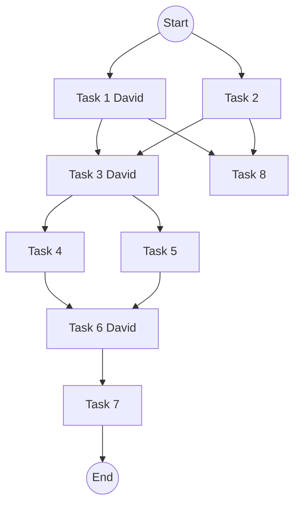

# Lab 2 Task Flowchart

```mermaid
flowchart TB
    start((Start))
    task1[Task 1 David]
    task2[Task 2]
    task3[Task 3 David]
    task4[Task 4]
    task5[Task 5]
    task6[Task 6 David]
    task7[Task 7]
    task8[Task 8]
    endd((End))
    
    start --> task1 & task2
    
    task1 --> task3
    task2 --> task3

    task1 --> task8
    task2 --> task8

    task3 --> task4 & task5
    task4 --> task6
    task5 --> task6
    task6 --> task7 --> endd
```