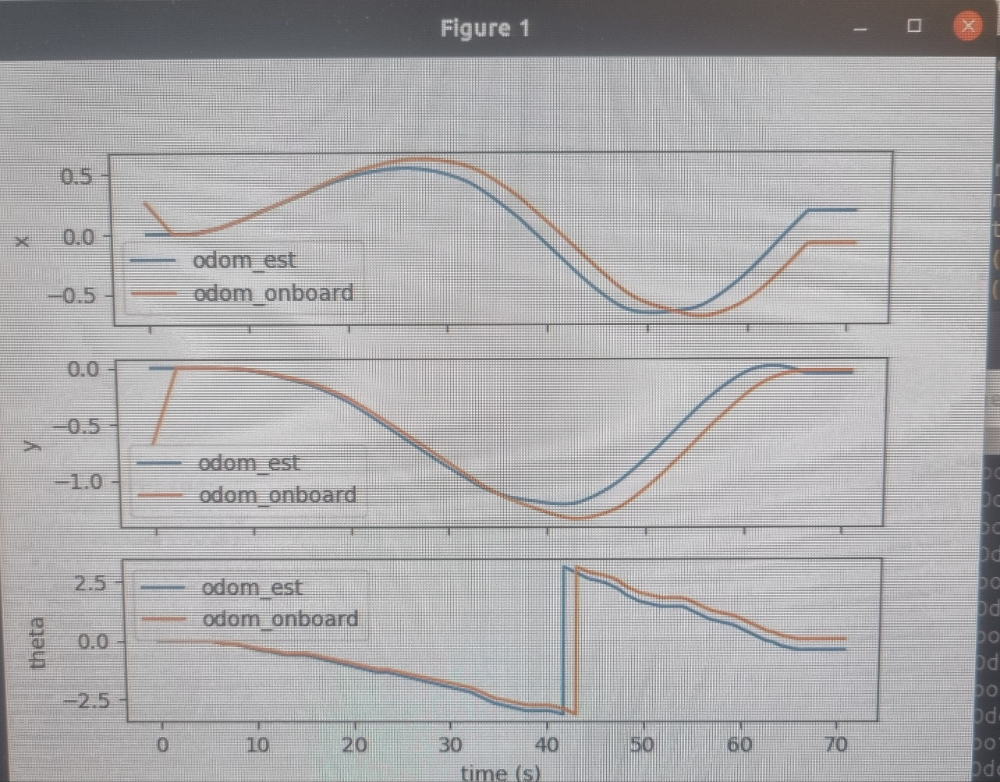
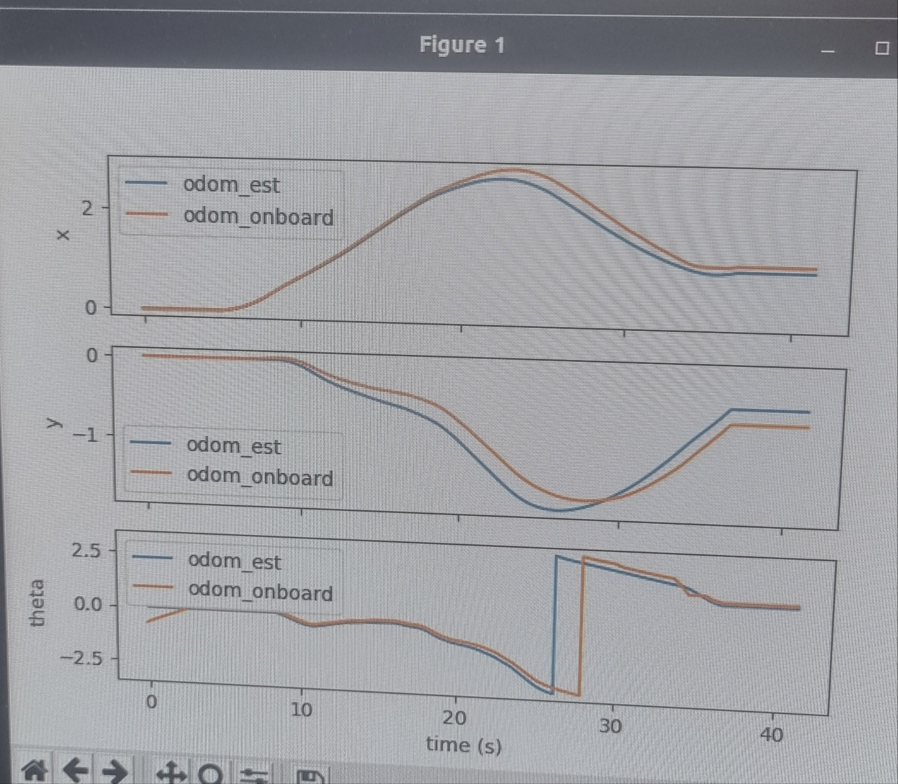
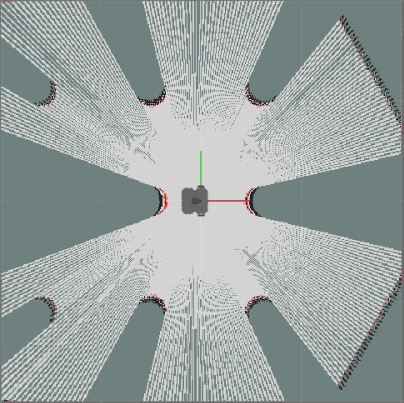
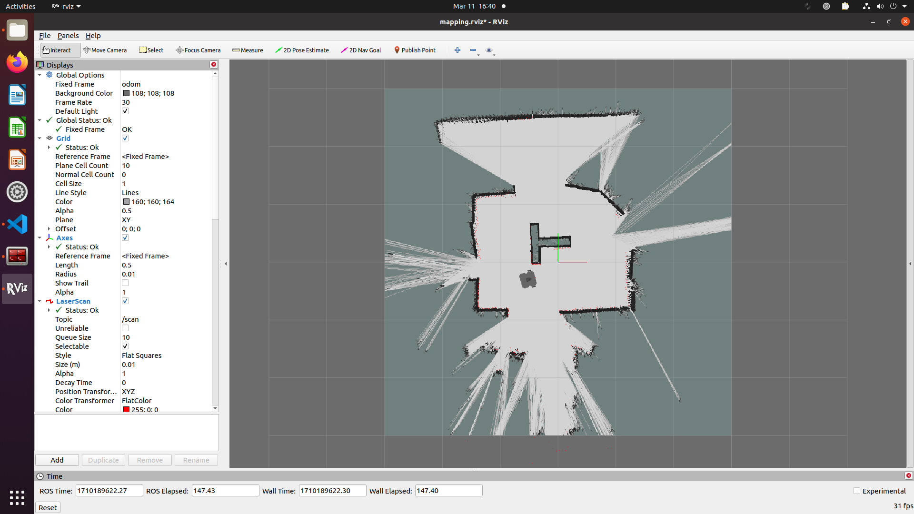

# Lab 3 Report

## Task 4 (David)

This task concerns two experiments used to validate key parameters of the robot from the manufacturer. The first experiment concerns the estimation of the wheel radius. The second experiment concerns the estimation of the wheel separation distance

### Wheel Radius Experiment
To determine the wheel radius, the following procedure is used:
1. Command robot to travel a known straight distance of 0.75m using teleop
2. Sum the encoder ticks for each wheel at each timestep
3. Solve for radius from the differential drive model
$$
r = \frac{2x_{\text{true}}}{\sum_k (\Delta \phi_r(kh) + \Delta \phi_\epsilon(kh))}
$$

A value of 0.032m for the radius was obtained through testing on the real robot. Compared to the datasheet radius of 0.0345m, this is a percentage error of 7.24%. A source of bias in the measurement is the large teleoperation delay. This caused the experimenters to overshoot or undershoot the 0.75m distance target. Overshooting the target yields a smaller than actual radius, whereas undershooting yields a larger than actual wheel radius. The root of this communications delay between the remote PC and the turtlebot would need to be resolved to mitigate this source of bias.

### Wheel Separation Experiment
To determine the wheel separation, the following procedure is adopted:
1. Command the robot to rotate 360 degrees in place.
2. Compute the difference between the left and right wheel encoder ticks
3. Calculate the wheel separation distance from the differential drive model:
$$
b = \frac{r}{2} \frac{\sum_k (\Delta \phi_r(kh) - \Delta \phi_\ell(kh))}{N \times 2\pi}
$$

A value of 0.285 was obtained for the wheel separation distance. The datasheet provides a factory value of 0.287. This is a percentage error of 0.70%. A source of uncertainty is introduced by way of the experimental procedure which relies of the visual acuity of the experimenters to determine when the robot has completed a full rotation exactly. This uncertainty causes the estimated wheel separation distance to be larger than actual when overshooting the full rotation, and smaller than actual when undershooting the full rotation. A laser measurement would help eliminate this uncertainty.

## Task 5 (Daye)

### Motion Estimation 

1. Two plots from the two experiments comparing our odom estimates with the onboard one. 

- 1-1. First experiment: driving in a circle with radius approximately 1m and returning to the same starting point 

- 1-2. Repeat for a more complex path 

2. Briefly discuss the results (1 pt)
   
 - 2-1. How is your estimation compared to the onboard one? Name one
possible source of error that accounts for the differences.

     - The lines are not perfectly overlaid, indicating potential errors or noise in the measurement or estimation process. One possible source of error could be inaccuracies in the robot's sensors or the method used to calculate the estimated odometry. This might include wheel slippage, sensor drift, or delays in data processing.

 - 2-2.  How are the estimates compared to the actual trajectory you observed? Name one possible source of error that accounts for the differences.

     - The estimated odometry seems to match the actual path taken by the robot as observed during the experiment. However, there are deviations, particularly visible in the complex path of the second experiment. A potential source of error affecting the match to the actual trajectory could be environmental factors, such as uneven terrain that might cause unexpected robot behavior.

## Task 6 (Davin)

### Occupancy Grid Mapping
The code updates the occupancy grid's log likelihood based on each lidar measurement. It retrieves all lidar points at each measurement interval, iterates through them, and for each point, updates the map. It adds "alpha" to the log likelihood of a predetermined number of points at the measurement coordinates (representing the observed part of the obstacle) and subtracts "beta" from the cells between the obstacle and the robot. To prevent overflow errors, a saturation value is imposed on the log likelihoods. This process is repeated as the robot moves to build a map of the environment.

A potential error in the algorithm could arise from the robot's dead reckoning. Dead reckoning accumulates errors over time without other measurements for reference, leading to an imprecise estimate of the robot's location and causing the map to shift ("drift") over time. The error is not prominent when the robot's odometry estimate is well-aligned with its simulated counterpart.
### Mapping in a Simulated Environment

### Mapping on a Real Robot

A potential error that did not present in simulation is that a real robot is subjected to external disturbances such as uneven ground surface, bumps, and wheel slippages that will not be accounted for by our odometry estimates. These can cause slight deviations between the robot's position and the odometry estimates, which, as mentioned in the previous section, can accumulate over time, leading to larger deviations as time progresses.