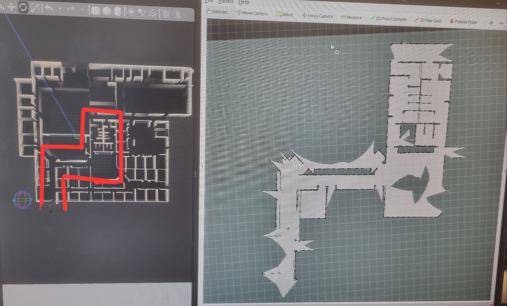

# ROB521 Lab 4 Report
David Maranto, Dayee Lee, Davin Chua
PRA0101 - Group 1


## Part 1: turtlebot3_world localization

AMCL RViz window with a converged filter with default values


As we lower the min-max AMCL particle counts, we see poorer localization performance. The image below shows the result of localization with `min_particles=9` and
`max_particles=94`. These values represent the minimum number of particles for successful localization, assuming the robot is driven under 0.1m/s. Any faster and the localization diverges. This was tested over three independent runs with different initial poses.


The maximum odom_alpha parameters were increased until localization diverged. This occurred at values in the neighborhood of 6.0.


## Part 2: Mapping turtlebot3_world

The following figure depicts our mapping result from Lab 3.


The following figure depicts our mapping result with GMapping.


**Comparison:** We found that the localization component of GMapping made the robot more robust against factors that could affect the resulting map. Previously in Lab 3, we found that external disturbances like bumps or wheel slippages could result in errors as the LIDAR scan only depends on odometry data. These errors resulted in "shifted" or "distorted" of the map that progressively gets worse the longer the robot moves. With GMapping however, we still experience distortions (when we hit an obstacle for example), but the algorithm is able to correct itself with lidar scan matching when it detects that it has returned to a previously visited point. This is also why it is important to have loop closures in our mapping path, as it helps to reduce cumulative error of the robot's estimated pose and generate a consistent global map.

## Part 3: Mapping willowgarge_world

```yaml
maxUrange: 5.0
srr: 0.05 
srt: 0.1 
str: 0.05
stt: 0.1 
particles: 150 
```

기존 Setting을 위와 같이 바꾸고 mapping을 하였으며 그 결과는 아래 그림과 같다. 
||
|---|
| Left image: The actual map of willowgarage_world, Right image: Map created by partially mapping the path using Gmapping. The parts corresponding to the right map from the actual left map are indicated with red lines. |

After changing the settings and performing gmapping, the result was a wrong map, indicating a failure in loop closure in SLAM.

Comparing the gmapping result map with the actual map, in the section where there is a turn from the bottom left to the right, it failed to perfectly map the wall, instead splitting it into two paths. Additionally, the map's angle is slightly tilted to the right. While mapping, the map also rotated and drifted slightly. When I attempted to close a loop, there seemed to be no specific problem, but the map appeared to shake a bit.

The adjustments I've made—increasing `particles` and `maxUrange` while decreasing `srr`, `srt`, `str`, and `stt`—aim to refine the mapping process by enhancing the algorithm's ability to capture more detail (with more particles and a longer usable range) and by assuming less noise in the robot's movement (with lower motion and turning noise parameters). 

We believe that experiencing discrepancies in the map after a loop closure, even with these adjustments, can still occur due to a variety of reasons:

1. **Increased Complexity with More Particles**: While increasing the number of particles can theoretically improve the map's accuracy by considering more potential robot paths, it also increases the complexity of the algorithm. This can lead to challenges in effectively managing all these particles, especially in environments where features are difficult to match precisely.

2. **Sensitivity to Parameters**: Reducing the noise parameters (`srr`, `srt`, `str`, `stt`) makes the algorithm less tolerant of inaccuracies in motion and turning. If the actual noise is higher than what you've configured, this discrepancy can lead to errors in how the robot's movement is interpreted, affecting loop closure accuracy.


## Part 4: Mapping Myhal
Below is a screenshot of the real Myhal mapped map.


During acquisition, it was noticed that the map would occasionally rotate out of place. We believe this to be due to occasional wheel slippage during turns, which introduces errors into the GMapping algorithm, which it then corrects for through lidar scan matching