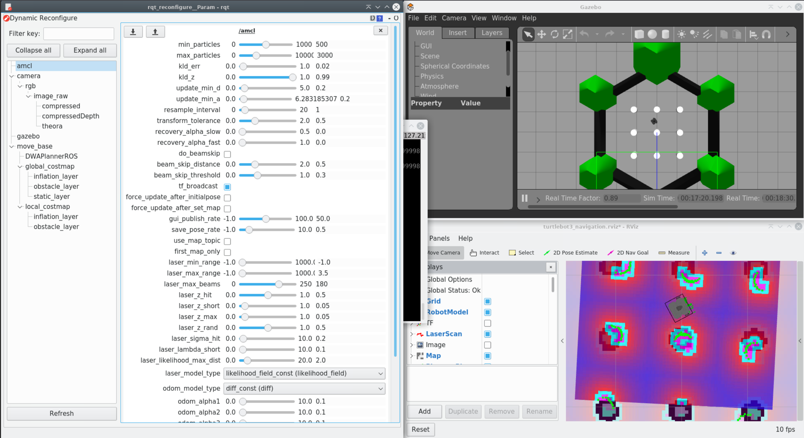
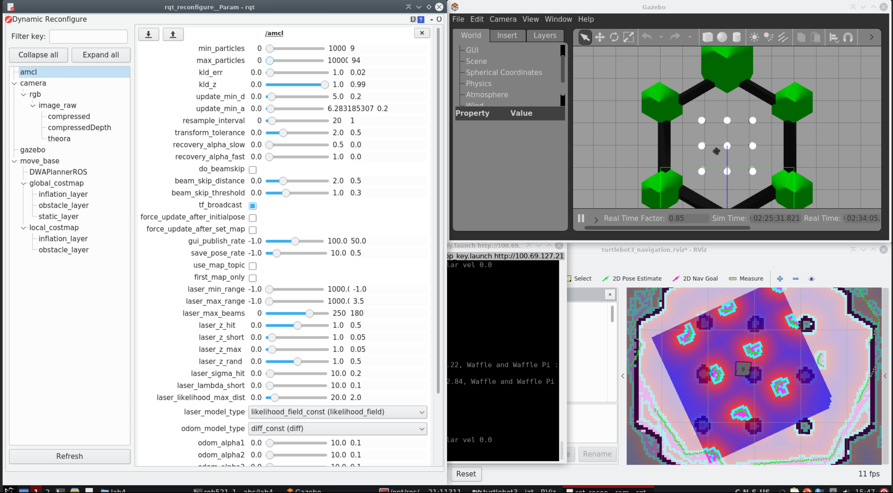
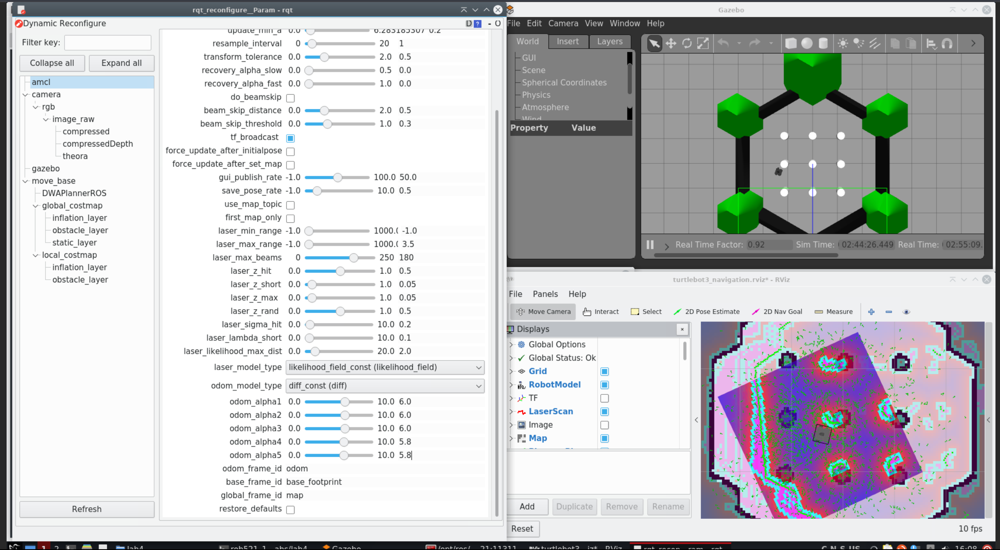
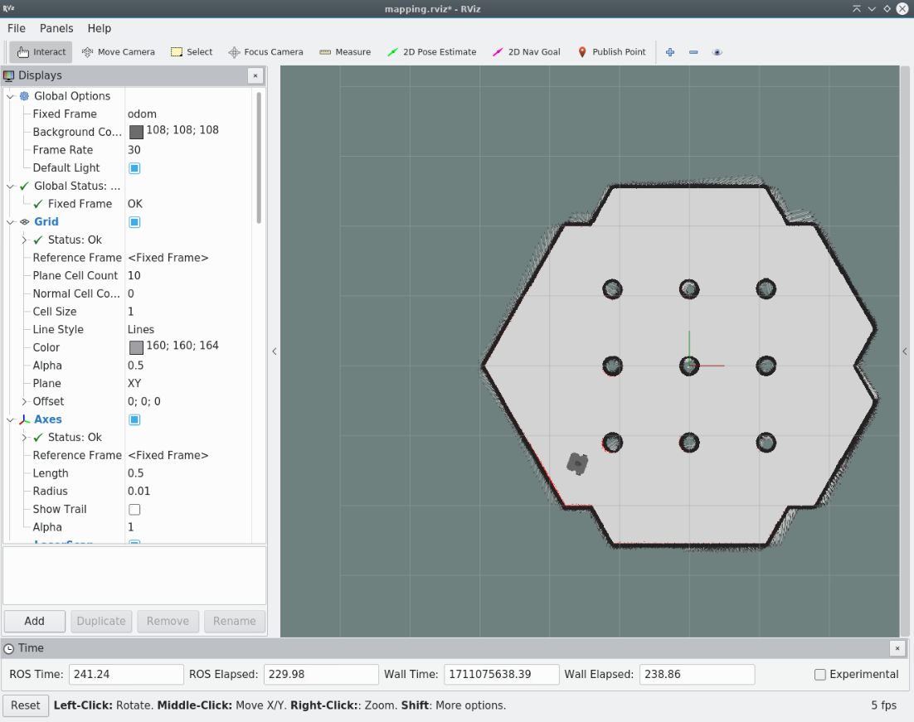
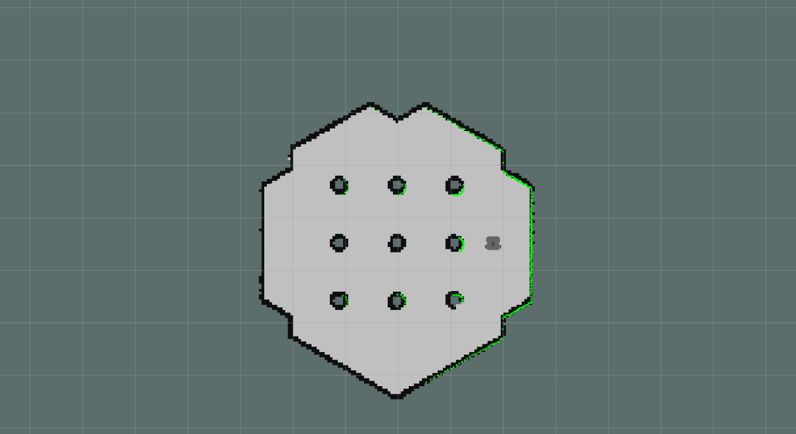
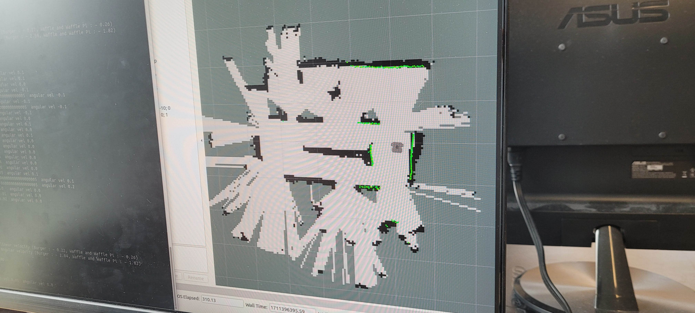

# ROB521 Lab 4 Report

## Part 1: turtlebot3_world localization

AMCL RViz window with a converged filter with default values

As we lower the min-max AMCL particle counts, we see poorer localization performance. The image below shows the result of localization with `min_particles=9` and
`max_particles=94`. These values represent the minimum number of particles for successful localization, assuming the robot is driven under 0.1m/s. Any faster and the localization diverges. This was tested over three independent runs with different initial poses.

The maximum odom_alpha parameters were increased until localization diverged. This occurred at values in the neighborhood of 6.0.

## Part 2: Mapping turtlebot3_world

## Part 3: Mapping willowgarge_world

## Part 4: Mapping Myhal
Below is a screenshot of the real Myhal mapped map.

During acquisition, it was noticed that the map would occasionally rotate out of place. We believe this to be due to occasional wheel slippage during turns, which introduces errors into the GMapping algorithm, which it then corrects for through lidar scan matching